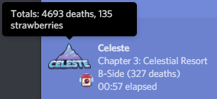

# celeste-rich-presence
Discord Rich Presence for Celeste (thrown together from an older version of [TF2 Rich Presence](https://github.com/Kataiser/tf2-rich-presence))

(The actual program is nowhere near as nice looking as this)

## Download
https://github.com/Kataiser/celeste-rich-presence/releases (celeste-rich-presence_v1.01.zip, 7.93 MB)

## IMPORTANT NOTES
- This gets its information from the save files of the game, which means that it only gets updated information when the game does a save. This may be rarer than you might expect, so if you really want it to be in sync with the game you'll have to do a save and quit. 
- It automatically switches to whichever save file has been modified most recently.
- It can't detect when you're in menus (currently). 
- It might crash, if it does, post the crash message [here](https://github.com/Kataiser/celeste-rich-presence/issues).
- The bottom line defaults to "yeet" because obviously.
